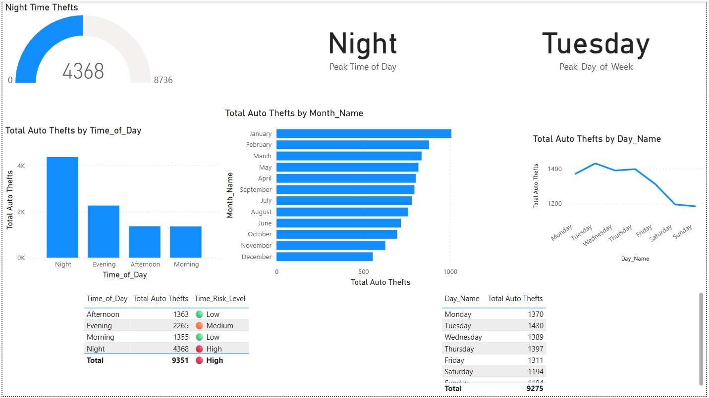
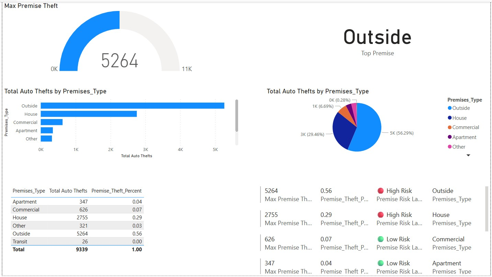
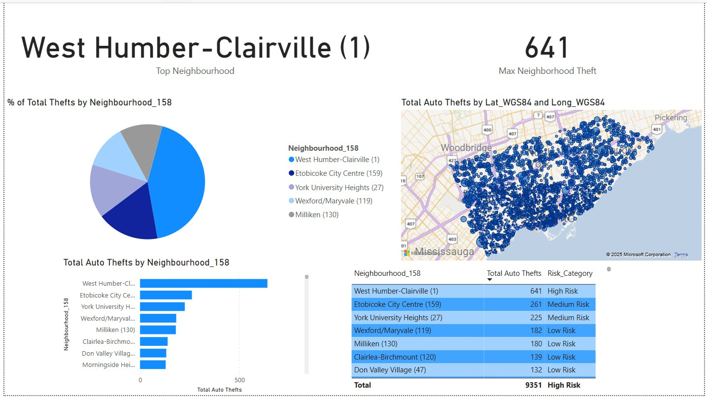
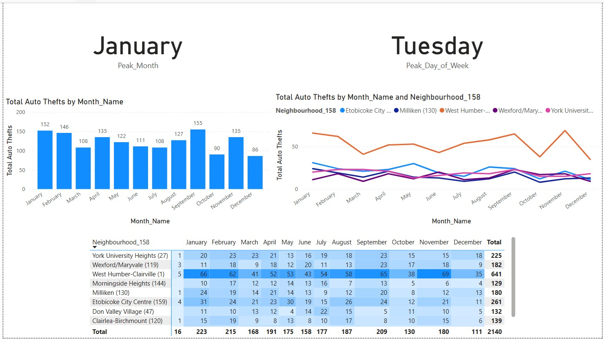

# 🚨 Toronto Auto Theft Analysis Dashboard

This capstone project leverages Toronto Police open data to analyze rising auto theft trends in the city. The team used Power BI to uncover high-risk neighborhoods, time-based patterns, and premises-related vulnerabilities, helping to inform smarter public safety and resource allocation strategies.

---

## 🎯 Project Objective

To explore and understand auto theft patterns across Toronto using data-driven visuals and uncover:
- Where thefts happen most frequently
- When they're most likely to occur
- Which types of premises are most vulnerable

---

## 🔍 Business Problem

Toronto has seen a significant rise in auto thefts. Traditional reporting doesn't offer real-time, actionable insights. Our challenge was to design a dashboard that could help law enforcement and policymakers:
- Identify high-risk neighborhoods and times
- Optimize patrols and public awareness efforts
- Better allocate limited resources

---

## 🔧 Tools & Data

- **Power BI** – for data visualization and dashboard design  
- **Excel** – for data cleaning and transformation  
- **Toronto Police Public Safety Open Data** – auto theft dataset  

---

## 📌 Key Findings

- **Neighborhoods**: West Humber–Clairville had the highest thefts; Don Valley Village the lowest.
- **Time Trends**: Most thefts occurred at **night**, especially on **Tuesdays**.
- **Seasonality**: **Winter months**, particularly **January** and **February**, showed peak activity.
- **Premises**: **Outside** and **house premises** accounted for over **80% of thefts**, making them the most vulnerable zones.
- **Optimization**: Focused patrols in high-risk areas and times can significantly reduce thefts.

---

## 📷 Dashboard Snapshots

### Overview


### Neighborhood Analysis


### Premises Type Analysis


### Time-Based Trends


## 📁 Project Structure
```
auto-theft-capstone/
│
├── data/ # Raw and cleaned auto theft data from Toronto Police (Excel)
├── powerbi/ # Power BI (.pbix) dashboard file
├── SCREENSHOTS/ # Dashboard screenshots for reference
└── README.md # Project description
```

---

## 👥 Credits
This project was completed as a **group capstone project** as part of the Business Insights & Analytics program at Humber College.  
Team Members: **Megha Nanda**, **Arsha Shaji Payyanayil**, **Lijo Johnson**, **Vasudha Chaubey** and **Myself**

---

## ⚠️ Usage Notice
This project is for **educational and portfolio purposes only**.  
Please do not reuse or distribute without permission.

---

## 📫 Let's Connect
I'm Devanshi Sharma — a data enthusiast passionate about transforming raw data into powerful insights.  
Feel free to connect with me on [LinkedIn](https://www.linkedin.com/in/sharmadevanshi2000)
